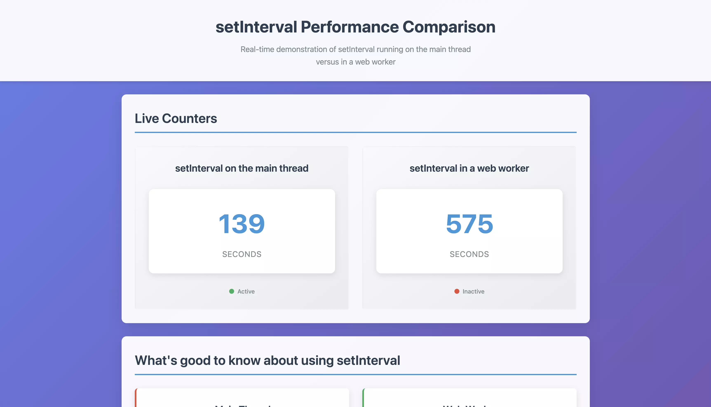
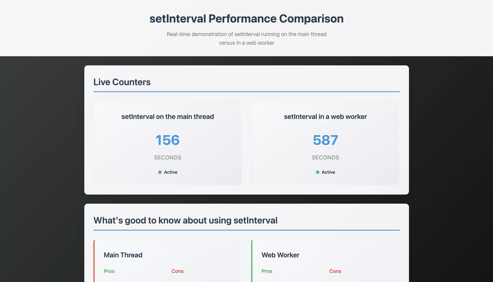

# Building things with AI 🤖

This is a playground where I dump things I build with AI. This is all about learning the tool and having fun in the process. I hope some of these project might actually be useful 🫣

## Set Interval demo ⏱️

This app (built entirely with Cursor) showcases the main differences of using `setInterval` on the main thread and a web worker. I've built 2 versions of this thing, the first iteration was a static HTML file with JavaScript, the second iteration is using React, TypeScript, pnpm and Jest with React Testing Library.

These demos show that after initial page load both counters run and while the web worker counter is accurate and keeps ticking regardless if the browser tab is active or it is deactivated, the normal counter (running on the main thread) gradually skips and after a short while there is a growing difference between the two tickers. The web worker runs accurately without skipping a beat.

### Iteration one (HTML)

[Check out the "Iteration one (HTML)" project](./00-set-interval-demo/00-iteration-one-html-js)

### Iteration two (React + TypeScript)

[Check out the "Iteration two (React)" project](./00-set-interval-demo/01-iteration-two-react-ts)

### Initial prompt

> In a new folder called 01-setinterval-test create a new project that compares setInterval running in the client and in a web worker in parallel on the same page. The page should show 2 columns, one with the heading "setInterval on the main thread" and one with "setInterval in a web worker". Under each heading show a counter starting from zero, which increases with each second passing. On the page below the counters in a new section (heading "What's good to know about using setInterval") explpain the pros and cons that highlight the key differences between the function running on the main thread and in a web worker. Add links to articles or other demos to the bottom of the page. Make sure the HTML is valid and is accessible to all users. Use styling that focuses on clarity and gives a modern look and feel.

2025 Rob Pataki
